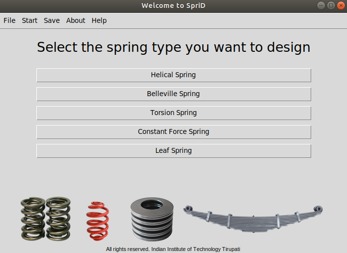
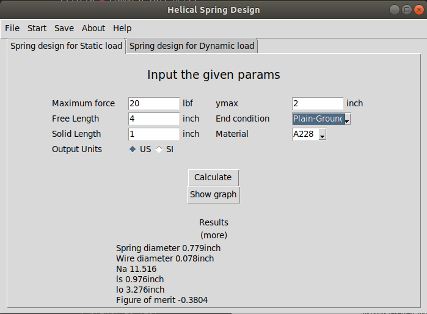

# SpriD
***

Spring designer with complete GUI built on python and tkinter. Can perform computations for both static and dynamic conditions

Note: please install the python missing modules if any.
https://github.com/AakashSYadav/SpriD/tree/master/Additional
**Authors:** Aakash Yadav

### Usage
  - To start the GUI run the `gui.py`file i.e.`python3 gui.py` from the command line
  - The resultant data is stored in `res.txt` along with the time stamp
  - Please refer to the documentation to see the algorithm and calculations [DME_Project_Report_SpriD.pdf](https://github.com/AakashSYadav/SpriD/tree/master/report/DME_Project_Report_SpriD.pdf)
  - To see the simulation run the `sim.py` (Note: At present the simulation is not binded to the main GUI)
  
### Requirements
  - Python 3.6+
  - Tkinter

### Dependencies
  - tkinter
  - PIL
  - sympy
  - matplotlib
  - vpython
  
### App GUI
  

